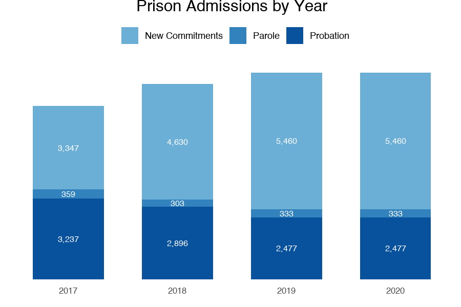
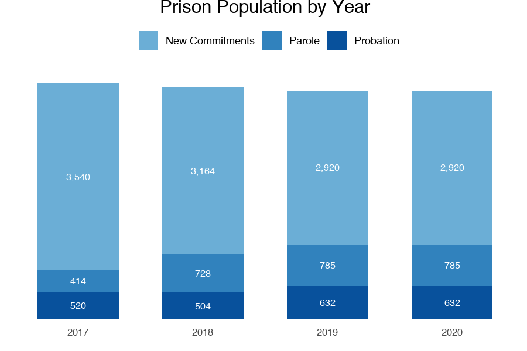
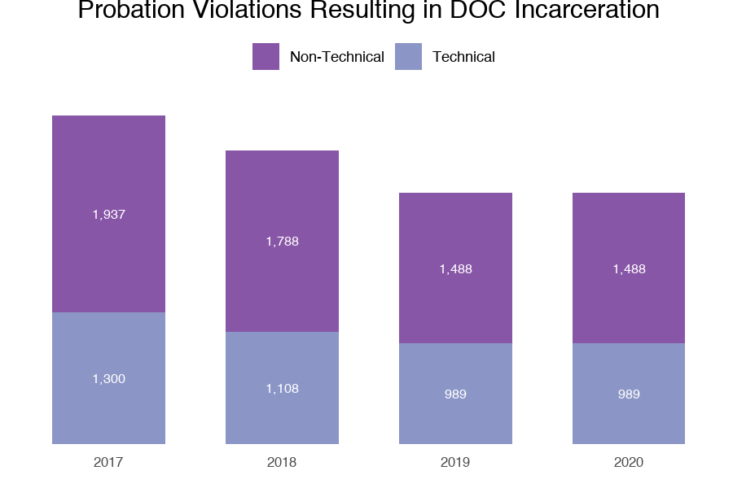
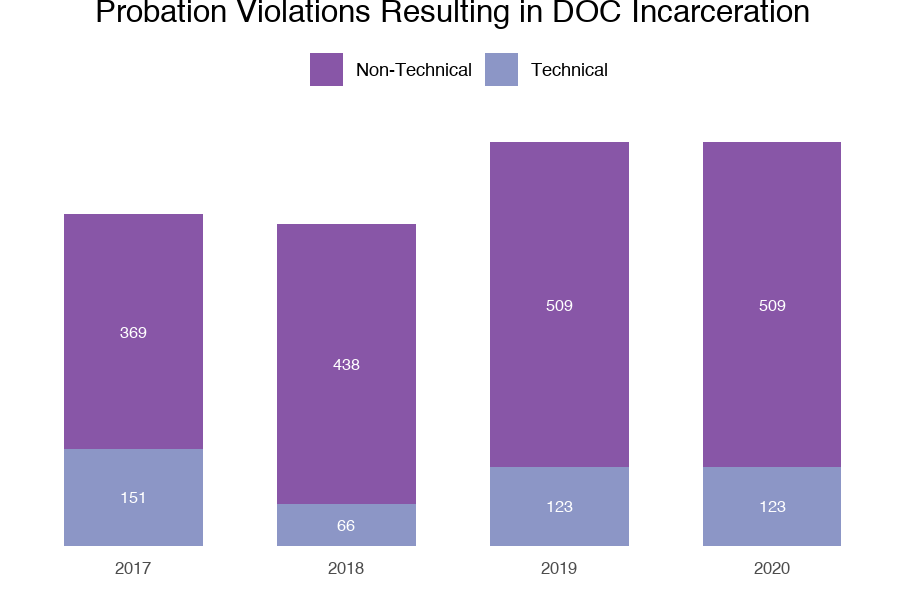
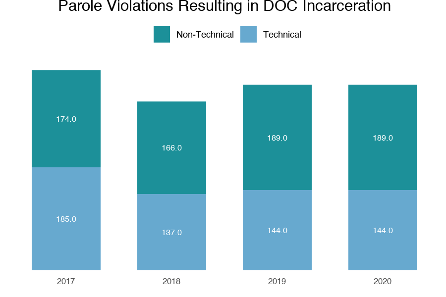
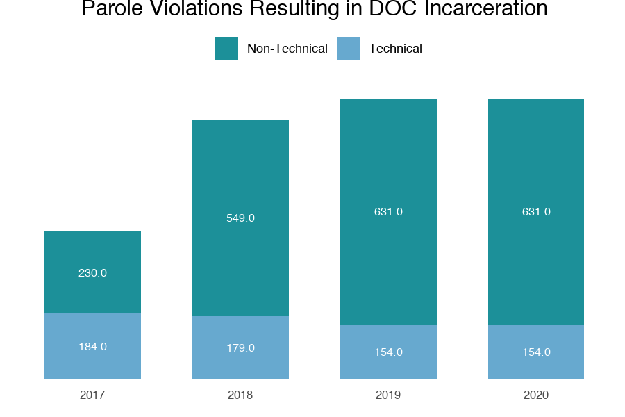

```{r setup, include=FALSE}
knitr::opts_chunk$set(echo = TRUE, warning = FALSE)
```

```{r message=FALSE, warning=FALSE, include=FALSE, paged.print=FALSE}
source("automated_clean.R") # run import and clean code
source("automated_plots.R") # run automated_plots code
source("automated_costs.R") # analyzes and creates tables of cost info
source("automated_tables.R") # run automated_tables code
```

\newpage
# Alabama

```{r echo=FALSE, message=FALSE, warning=FALSE, paged.print=FALSE}
kable(Alabama, format = 'markdown', padding=1.5L)
# kable(Alabama_Expenditures, format = 'markdown', padding=1.5L)
```
  
```{r echo=FALSE, message=FALSE, warning=FALSE, out.width="50%", paged.print=FALSE}
knitr::include_graphics("plots/adm_by_year_Alabama.png")
knitr::include_graphics("plots/pop_by_year_Alabama.png")
knitr::include_graphics("plots/adm_prob_Alabama.png")
knitr::include_graphics("plots/pop_prob_Alabama.png")
knitr::include_graphics("plots/adm_parole_Alabama.png")
knitr::include_graphics("plots/pop_parole_Alabama.png")
```

\newpage
# Alaska

```{r echo=FALSE, message=FALSE, warning=FALSE, paged.print=FALSE}
kable(Alaska, format = 'markdown', padding=1.5L)
# kable(Alaska_Expenditures, format = 'markdown', padding=1.5L)
```

```{r echo=FALSE, message=FALSE, warning=FALSE, out.width="50%", paged.print=FALSE}
knitr::include_graphics("plots/adm_by_year_Alaska.png")
knitr::include_graphics("plots/pop_by_year_Alaska.png")
knitr::include_graphics("plots/adm_prob_Alaska.png")
knitr::include_graphics("plots/pop_prob_Alaska.png")
knitr::include_graphics("plots/adm_parole_Alaska.png")
knitr::include_graphics("plots/pop_parole_Alaska.png")
```

\newpage
# Arizona

```{r echo=FALSE, message=FALSE, warning=FALSE, paged.print=FALSE}
kable(Arizona, format = 'markdown', padding=1.5L)
# kable(Arizona_Expenditures, format = 'markdown', padding=1.5L)
```

```{r echo=FALSE, message=FALSE, warning=FALSE, out.width="50%", paged.print=FALSE}
knitr::include_graphics("plots/adm_by_year_Arizona.png")
knitr::include_graphics("plots/pop_by_year_Arizona.png")
knitr::include_graphics("plots/adm_prob_Arizona.png")
knitr::include_graphics("plots/pop_prob_Arizona.png")
knitr::include_graphics("plots/adm_parole_Arizona.png")
knitr::include_graphics("plots/pop_parole_Arizona.png")
```

\newpage
# Arkansas

```{r echo=FALSE, message=FALSE, warning=FALSE, paged.print=FALSE}
kable(Arkansas, format = 'markdown', padding=1.5L)
# kable(Arkansas_Expenditures, format = 'markdown', padding=1.5L)
```

```{r echo=FALSE, message=FALSE, warning=FALSE, out.width="50%", paged.print=FALSE}
knitr::include_graphics("plots/adm_by_year_Arkansas.png")
knitr::include_graphics("plots/pop_by_year_Arkansas.png")
knitr::include_graphics("plots/adm_prob_Arkansas.png")
knitr::include_graphics("plots/pop_prob_Arkansas.png")
knitr::include_graphics("plots/adm_parole_Arkansas.png")
knitr::include_graphics("plots/pop_parole_Arkansas.png")
```

\newpage
# California

```{r echo=FALSE, message=FALSE, warning=FALSE, paged.print=FALSE}
kable(California, format = 'markdown', padding=1.5L)
# kable(California_Expenditures, format = 'markdown', padding=1.5L)
```

```{r echo=FALSE, message=FALSE, warning=FALSE, out.width="50%", paged.print=FALSE}
knitr::include_graphics("plots/adm_by_year_California.png")
knitr::include_graphics("plots/pop_by_year_California.png")
knitr::include_graphics("plots/adm_prob_California.png")
knitr::include_graphics("plots/pop_prob_California.png")
knitr::include_graphics("plots/adm_parole_California.png")
knitr::include_graphics("plots/pop_parole_California.png")
```

\newpage
# Colorado

```{r echo=FALSE, message=FALSE, warning=FALSE, paged.print=FALSE}
kable(Colorado, format = 'markdown', padding=1.5L)
# kable(Colorado_Expenditures, format = 'markdown', padding=1.5L)
```

```{r echo=FALSE, message=FALSE, warning=FALSE, out.width="50%", paged.print=FALSE}
knitr::include_graphics("plots/adm_by_year_Colorado.png")
knitr::include_graphics("plots/pop_by_year_Colorado.png")
knitr::include_graphics("plots/adm_prob_Colorado.png")
knitr::include_graphics("plots/pop_prob_Colorado.png")
knitr::include_graphics("plots/adm_parole_Colorado.png")
knitr::include_graphics("plots/pop_parole_Colorado.png")
```

\newpage
# Connecticut

```{r echo=FALSE, message=FALSE, warning=FALSE, paged.print=FALSE}
kable(Connecticut, format = 'markdown', padding=1.5L)
# kable(Connecticut_Expenditures, format = 'markdown', padding=1.5L)
```

```{r echo=FALSE, message=FALSE, warning=FALSE, out.width="50%", paged.print=FALSE}
knitr::include_graphics("plots/adm_by_year_Connecticut.png")
knitr::include_graphics("plots/pop_by_year_Connecticut.png")
knitr::include_graphics("plots/adm_prob_Connecticut.png")
knitr::include_graphics("plots/pop_prob_Connecticut.png")
knitr::include_graphics("plots/adm_parole_Connecticut.png")
knitr::include_graphics("plots/pop_parole_Connecticut.png")
```

\newpage
# Delaware

```{r echo=FALSE, message=FALSE, warning=FALSE, paged.print=FALSE}
kable(Delaware, format = 'markdown', padding=1.5L)
# kable(Delaware_Expenditures, format = 'markdown', padding=1.5L)
```

```{r echo=FALSE, message=FALSE, warning=FALSE, out.width="50%", paged.print=FALSE}
knitr::include_graphics("plots/adm_by_year_Delaware.png")
knitr::include_graphics("plots/pop_by_year_Delaware.png")
knitr::include_graphics("plots/adm_prob_Delaware.png")
knitr::include_graphics("plots/pop_prob_Delaware.png")
knitr::include_graphics("plots/adm_parole_Delaware.png")
knitr::include_graphics("plots/pop_parole_Delaware.png")
```

\newpage
# Florida

```{r echo=FALSE, message=FALSE, warning=FALSE, paged.print=FALSE}
kable(Florida, format = 'markdown', padding=1.5L)
# kable(Florida_Expenditures, format = 'markdown', padding=1.5L)
```

```{r echo=FALSE, message=FALSE, warning=FALSE, out.width="50%", paged.print=FALSE}
knitr::include_graphics("plots/adm_by_year_Florida.png")
knitr::include_graphics("plots/pop_by_year_Florida.png")
knitr::include_graphics("plots/adm_prob_Florida.png")
knitr::include_graphics("plots/pop_prob_Florida.png")
knitr::include_graphics("plots/adm_parole_Florida.png")
knitr::include_graphics("plots/pop_parole_Florida.png")
```

\newpage
# Georgia

```{r echo=FALSE, message=FALSE, warning=FALSE, paged.print=FALSE}
kable(Georgia, format = 'markdown', padding=1.5L)
# kable(Georgia_Expenditures, format = 'markdown', padding=1.5L)
```

```{r echo=FALSE, message=FALSE, warning=FALSE, out.width="50%", paged.print=FALSE}
knitr::include_graphics("plots/adm_by_year_Georgia.png")
knitr::include_graphics("plots/pop_by_year_Georgia.png")
knitr::include_graphics("plots/adm_prob_Georgia.png")
knitr::include_graphics("plots/pop_prob_Georgia.png")
knitr::include_graphics("plots/adm_parole_Georgia.png")
knitr::include_graphics("plots/pop_parole_Georgia.png")
```

\newpage
# Hawaii

```{r echo=FALSE, message=FALSE, warning=FALSE, paged.print=FALSE}
kable(Hawaii, format = 'markdown', padding=1.5L)
# kable(Hawaii_Expenditures, format = 'markdown', padding=1.5L)
```

```{r echo=FALSE, message=FALSE, warning=FALSE, out.width="50%", paged.print=FALSE}






```

\newpage
# Idaho

```{r echo=FALSE, message=FALSE, warning=FALSE, paged.print=FALSE}
kable(Idaho, format = 'markdown', padding=1.5L)
# kable(Idaho_Expenditures, format = 'markdown', padding=1.5L)
```

```{r echo=FALSE, message=FALSE, warning=FALSE, out.width="50%", paged.print=FALSE}
knitr::include_graphics("plots/adm_by_year_Idaho.png")
knitr::include_graphics("plots/pop_by_year_Idaho.png")
knitr::include_graphics("plots/adm_prob_Idaho.png")
knitr::include_graphics("plots/pop_prob_Idaho.png")
knitr::include_graphics("plots/adm_parole_Idaho.png")
knitr::include_graphics("plots/pop_parole_Idaho.png")
```

\newpage
# Illinois

```{r echo=FALSE, message=FALSE, warning=FALSE, paged.print=FALSE}
kable(Illinois, format = 'markdown', padding=1.5L)
# kable(Illinois_Expenditures, format = 'markdown', padding=1.5L)
```

```{r echo=FALSE, message=FALSE, warning=FALSE, out.width="50%", paged.print=FALSE}
knitr::include_graphics("plots/adm_by_year_Illinois.png")
knitr::include_graphics("plots/pop_by_year_Illinois.png")
knitr::include_graphics("plots/adm_prob_Illinois.png")
knitr::include_graphics("plots/pop_prob_Illinois.png")
knitr::include_graphics("plots/adm_parole_Illinois.png")
knitr::include_graphics("plots/pop_parole_Illinois.png")
```

\newpage
# Kansas

```{r echo=FALSE, message=FALSE, warning=FALSE, paged.print=FALSE}
kable(Kansas, format = 'markdown', padding=1.5L)
# kable(Kansas_Expenditures, format = 'markdown', padding=1.5L)
```

```{r echo=FALSE, message=FALSE, warning=FALSE, out.width="50%", paged.print=FALSE}
knitr::include_graphics("plots/adm_by_year_Kansas.png")
knitr::include_graphics("plots/pop_by_year_Kansas.png")
knitr::include_graphics("plots/adm_prob_Kansas.png")
knitr::include_graphics("plots/pop_prob_Kansas.png")
knitr::include_graphics("plots/adm_parole_Kansas.png")
knitr::include_graphics("plots/pop_parole_Kansas.png")
```

\newpage
# Louisiana

```{r echo=FALSE, message=FALSE, warning=FALSE, paged.print=FALSE}
kable(Louisiana, format = 'markdown', padding=1.5L)
# kable(Louisiana_Expenditures, format = 'markdown', padding=1.5L)
```

```{r echo=FALSE, message=FALSE, warning=FALSE, out.width="50%", paged.print=FALSE}
knitr::include_graphics("plots/adm_by_year_Louisiana.png")
knitr::include_graphics("plots/pop_by_year_Louisiana.png")
knitr::include_graphics("plots/adm_prob_Louisiana.png")
knitr::include_graphics("plots/pop_prob_Louisiana.png")
knitr::include_graphics("plots/adm_parole_Louisiana.png")
knitr::include_graphics("plots/pop_parole_Louisiana.png")
```

\newpage
# Maine

```{r echo=FALSE, message=FALSE, warning=FALSE, paged.print=FALSE}
kable(Maine, format = 'markdown', padding=1.5L)
# kable(Maine_Expenditures, format = 'markdown', padding=1.5L)
```

```{r echo=FALSE, message=FALSE, warning=FALSE, out.width="50%", paged.print=FALSE}
knitr::include_graphics("plots/adm_by_year_Maine.png")
knitr::include_graphics("plots/pop_by_year_Maine.png")
knitr::include_graphics("plots/adm_prob_Maine.png")
knitr::include_graphics("plots/pop_prob_Maine.png")
knitr::include_graphics("plots/adm_parole_Maine.png")
knitr::include_graphics("plots/pop_parole_Maine.png")
```

\newpage
# Maryland

```{r echo=FALSE, message=FALSE, warning=FALSE, paged.print=FALSE}
kable(Maryland, format = 'markdown', padding=1.5L)
# kable(Maryland_Expenditures, format = 'markdown', padding=1.5L)
```

```{r echo=FALSE, message=FALSE, warning=FALSE, out.width="50%", paged.print=FALSE}
knitr::include_graphics("plots/adm_by_year_Maryland.png")
knitr::include_graphics("plots/pop_by_year_Maryland.png")
knitr::include_graphics("plots/adm_prob_Maryland.png")
knitr::include_graphics("plots/pop_prob_Maryland.png")
knitr::include_graphics("plots/adm_parole_Maryland.png")
knitr::include_graphics("plots/pop_parole_Maryland.png")
```

\newpage
# Mississippi

```{r echo=FALSE, message=FALSE, warning=FALSE, paged.print=FALSE}
kable(Mississippi, format = 'markdown', padding=1.5L)
# kable(Mississippi_Expenditures, format = 'markdown', padding=1.5L)
```

```{r echo=FALSE, message=FALSE, warning=FALSE, out.width="50%", paged.print=FALSE}
knitr::include_graphics("plots/adm_by_year_Mississippi.png")
knitr::include_graphics("plots/pop_by_year_Mississippi.png")
knitr::include_graphics("plots/adm_prob_Mississippi.png")
knitr::include_graphics("plots/pop_prob_Mississippi.png")
knitr::include_graphics("plots/adm_parole_Mississippi.png")
knitr::include_graphics("plots/pop_parole_Mississippi.png")
```

\newpage
# Missouri

```{r echo=FALSE, message=FALSE, warning=FALSE, paged.print=FALSE}
kable(Missouri, format = 'markdown', padding=1.5L)
# kable(Missouri_Expenditures, format = 'markdown', padding=1.5L)
```

```{r echo=FALSE, message=FALSE, warning=FALSE, out.width="50%", paged.print=FALSE}
knitr::include_graphics("plots/adm_by_year_Missouri.png")
knitr::include_graphics("plots/pop_by_year_Missouri.png")
knitr::include_graphics("plots/adm_prob_Missouri.png")
knitr::include_graphics("plots/pop_prob_Missouri.png")
knitr::include_graphics("plots/adm_parole_Missouri.png")
knitr::include_graphics("plots/pop_parole_Missouri.png")
```

\newpage
# Montana

```{r echo=FALSE, message=FALSE, warning=FALSE, paged.print=FALSE}
kable(Montana, format = 'markdown', padding=1.5L)
# kable(Montana_Expenditures, format = 'markdown', padding=1.5L)
```

```{r echo=FALSE, message=FALSE, warning=FALSE, out.width="50%", paged.print=FALSE}
knitr::include_graphics("plots/adm_by_year_Montana.png")
knitr::include_graphics("plots/pop_by_year_Montana.png")
knitr::include_graphics("plots/adm_prob_Montana.png")
knitr::include_graphics("plots/pop_prob_Montana.png")
knitr::include_graphics("plots/adm_parole_Montana.png")
knitr::include_graphics("plots/pop_parole_Montana.png")
```

\newpage
# Nevada

```{r echo=FALSE, message=FALSE, warning=FALSE, paged.print=FALSE}
kable(Nevada, format = 'markdown', padding=1.5L)
# kable(Nevada_Expenditures, format = 'markdown', padding=1.5L)
```

```{r echo=FALSE, message=FALSE, warning=FALSE, out.width="50%", paged.print=FALSE}
knitr::include_graphics("plots/adm_by_year_Nevada.png")
knitr::include_graphics("plots/pop_by_year_Nevada.png")
knitr::include_graphics("plots/adm_prob_Nevada.png")
knitr::include_graphics("plots/pop_prob_Nevada.png")
knitr::include_graphics("plots/adm_parole_Nevada.png")
knitr::include_graphics("plots/pop_parole_Nevada.png")
```

\newpage
# New Hampshire

```{r echo=FALSE, message=FALSE, warning=FALSE, paged.print=FALSE}
kable(`New Hampshire`, format = 'markdown', padding=1.5L)
# kable(New Hampshire_Expenditures, format = 'markdown', padding=1.5L)
```

```{r echo=FALSE, message=FALSE, warning=FALSE, out.width="50%", paged.print=FALSE}
knitr::include_graphics("plots/adm_by_year_New Hampshire.png")
knitr::include_graphics("plots/pop_by_year_New Hampshire.png")
knitr::include_graphics("plots/adm_prob_New Hampshire.png")
knitr::include_graphics("plots/pop_prob_New Hampshire.png")
knitr::include_graphics("plots/adm_parole_New Hampshire.png")
knitr::include_graphics("plots/pop_parole_New Hampshire.png")
```

\newpage
# New Jersey

```{r echo=FALSE, message=FALSE, warning=FALSE, paged.print=FALSE}
kable(`New Jersey`, format = 'markdown', padding=1.5L)
# kable(New Jersey_Expenditures, format = 'markdown', padding=1.5L)
```

```{r echo=FALSE, message=FALSE, warning=FALSE, out.width="50%", paged.print=FALSE}
knitr::include_graphics("plots/adm_by_year_New Jersey.png")
knitr::include_graphics("plots/pop_by_year_New Jersey.png")
knitr::include_graphics("plots/adm_prob_New Jersey.png")
knitr::include_graphics("plots/pop_prob_New Jersey.png")
knitr::include_graphics("plots/adm_parole_New Jersey.png")
knitr::include_graphics("plots/pop_parole_New Jersey.png")
```

\newpage
# North Carolina

```{r echo=FALSE, message=FALSE, warning=FALSE, paged.print=FALSE}
kable(`North Carolina`, format = 'markdown', padding=1.5L)
# kable(North Carolina_Expenditures, format = 'markdown', padding=1.5L)
```

```{r echo=FALSE, message=FALSE, warning=FALSE, out.width="50%", paged.print=FALSE}
knitr::include_graphics("plots/adm_by_year_North Carolina.png")
knitr::include_graphics("plots/pop_by_year_North Carolina.png")
knitr::include_graphics("plots/adm_prob_North Carolina.png")
knitr::include_graphics("plots/pop_prob_North Carolina.png")
knitr::include_graphics("plots/adm_parole_North Carolina.png")
knitr::include_graphics("plots/pop_parole_North Carolina.png")
```

\newpage
# North Dakota

```{r echo=FALSE, message=FALSE, warning=FALSE, paged.print=FALSE}
kable(`North Dakota`, format = 'markdown', padding=1.5L)
# kable(North Dakota_Expenditures, format = 'markdown', padding=1.5L)
```

```{r echo=FALSE, message=FALSE, warning=FALSE, out.width="50%", paged.print=FALSE}
knitr::include_graphics("plots/adm_by_year_North Dakota.png")
knitr::include_graphics("plots/pop_by_year_North Dakota.png")
knitr::include_graphics("plots/adm_prob_North Dakota.png")
knitr::include_graphics("plots/pop_prob_North Dakota.png")
knitr::include_graphics("plots/adm_parole_North Dakota.png")
knitr::include_graphics("plots/pop_parole_North Dakota.png")
```

\newpage
# Oklahoma

```{r echo=FALSE, message=FALSE, warning=FALSE, paged.print=FALSE}
kable(Oklahoma, format = 'markdown', padding=1.5L)
# kable(Oklahoma_Expenditures, format = 'markdown', padding=1.5L)
```

```{r echo=FALSE, message=FALSE, warning=FALSE, out.width="50%", paged.print=FALSE}
knitr::include_graphics("plots/adm_by_year_Oklahoma.png")
knitr::include_graphics("plots/pop_by_year_Oklahoma.png")
knitr::include_graphics("plots/adm_prob_Oklahoma.png")
knitr::include_graphics("plots/pop_prob_Oklahoma.png")
knitr::include_graphics("plots/adm_parole_Oklahoma.png")
knitr::include_graphics("plots/pop_parole_Oklahoma.png")
```

\newpage
# Oregon

```{r echo=FALSE, message=FALSE, warning=FALSE, paged.print=FALSE}
kable(Oregon, format = 'markdown', padding=1.5L)
# kable(Oregon_Expenditures, format = 'markdown', padding=1.5L)
```

```{r echo=FALSE, message=FALSE, warning=FALSE, out.width="50%", paged.print=FALSE}
knitr::include_graphics("plots/adm_by_year_Oregon.png")
knitr::include_graphics("plots/pop_by_year_Oregon.png")
knitr::include_graphics("plots/adm_prob_Oregon.png")
knitr::include_graphics("plots/pop_prob_Oregon.png")
knitr::include_graphics("plots/adm_parole_Oregon.png")
knitr::include_graphics("plots/pop_parole_Oregon.png")
```

\newpage
# Pennsylvania

```{r echo=FALSE, message=FALSE, warning=FALSE, paged.print=FALSE}
kable(Pennsylvania, format = 'markdown', padding=1.5L)
# kable(Pennsylvania_Expenditures, format = 'markdown', padding=1.5L)
```

```{r echo=FALSE, message=FALSE, warning=FALSE, out.width="50%", paged.print=FALSE}
knitr::include_graphics("plots/adm_by_year_Pennsylvania.png")
knitr::include_graphics("plots/pop_by_year_Pennsylvania.png")
knitr::include_graphics("plots/adm_prob_Pennsylvania.png")
knitr::include_graphics("plots/pop_prob_Pennsylvania.png")
knitr::include_graphics("plots/adm_parole_Pennsylvania.png")
knitr::include_graphics("plots/pop_parole_Pennsylvania.png")
```

\newpage
# Rhode Island

```{r echo=FALSE, message=FALSE, warning=FALSE, paged.print=FALSE}
kable(`Rhode Island`, format = 'markdown', padding=1.5L)
# kable(Rhode Island_Expenditures, format = 'markdown', padding=1.5L)
```

```{r echo=FALSE, message=FALSE, warning=FALSE, out.width="50%", paged.print=FALSE}
knitr::include_graphics("plots/adm_by_year_Rhode Island.png")
knitr::include_graphics("plots/pop_by_year_Rhode Island.png")
knitr::include_graphics("plots/adm_prob_Rhode Island.png")
knitr::include_graphics("plots/pop_prob_Rhode Island.png")
knitr::include_graphics("plots/adm_parole_Rhode Island.png")
knitr::include_graphics("plots/pop_parole_Rhode Island.png")
```

\newpage
# South Carolina

```{r echo=FALSE, message=FALSE, warning=FALSE, paged.print=FALSE}
kable(`South Carolina`, format = 'markdown', padding=1.5L)
# kable(South Carolina_Expenditures, format = 'markdown', padding=1.5L)
```

```{r echo=FALSE, message=FALSE, warning=FALSE, out.width="50%", paged.print=FALSE}
knitr::include_graphics("plots/adm_by_year_South Carolina.png")
knitr::include_graphics("plots/pop_by_year_South Carolina.png")
knitr::include_graphics("plots/adm_prob_South Carolina.png")
knitr::include_graphics("plots/pop_prob_South Carolina.png")
knitr::include_graphics("plots/adm_parole_South Carolina.png")
knitr::include_graphics("plots/pop_parole_South Carolina.png")
```

\newpage
# South Dakota

```{r echo=FALSE, message=FALSE, warning=FALSE, paged.print=FALSE}
kable(`South Dakota`, format = 'markdown', padding=1.5L)
# kable(South Dakota_Expenditures, format = 'markdown', padding=1.5L)
```

```{r echo=FALSE, message=FALSE, warning=FALSE, out.width="50%", paged.print=FALSE}
knitr::include_graphics("plots/adm_by_year_South Dakota.png")
knitr::include_graphics("plots/pop_by_year_South Dakota.png")
knitr::include_graphics("plots/adm_prob_South Dakota.png")
knitr::include_graphics("plots/pop_prob_South Dakota.png")
knitr::include_graphics("plots/adm_parole_South Dakota.png")
knitr::include_graphics("plots/pop_parole_South Dakota.png")
```

\newpage
# Texas

```{r echo=FALSE, message=FALSE, warning=FALSE, paged.print=FALSE}
kable(Texas, format = 'markdown', padding=1.5L)
# kable(Texas_Expenditures, format = 'markdown', padding=1.5L)
```

```{r echo=FALSE, message=FALSE, warning=FALSE, out.width="50%", paged.print=FALSE}
knitr::include_graphics("plots/adm_by_year_Texas.png")
knitr::include_graphics("plots/pop_by_year_Texas.png")
knitr::include_graphics("plots/adm_prob_Texas.png")
knitr::include_graphics("plots/pop_prob_Texas.png")
knitr::include_graphics("plots/adm_parole_Texas.png")
knitr::include_graphics("plots/pop_parole_Texas.png")
```

\newpage
# Utah

```{r echo=FALSE, message=FALSE, warning=FALSE, paged.print=FALSE}
kable(Utah, format = 'markdown', padding=1.5L)
# kable(Utah_Expenditures, format = 'markdown', padding=1.5L)
```

```{r echo=FALSE, message=FALSE, warning=FALSE, out.width="50%", paged.print=FALSE}
knitr::include_graphics("plots/adm_by_year_Utah.png")
knitr::include_graphics("plots/pop_by_year_Utah.png")
knitr::include_graphics("plots/adm_prob_Utah.png")
knitr::include_graphics("plots/pop_prob_Utah.png")
knitr::include_graphics("plots/adm_parole_Utah.png")
knitr::include_graphics("plots/pop_parole_Utah.png")
```

\newpage
# Vermont

```{r echo=FALSE, message=FALSE, warning=FALSE, paged.print=FALSE}
kable(Vermont, format = 'markdown', padding=1.5L)
# kable(Vermont_Expenditures, format = 'markdown', padding=1.5L)
```

```{r echo=FALSE, message=FALSE, warning=FALSE, out.width="50%", paged.print=FALSE}
knitr::include_graphics("plots/adm_by_year_Vermont.png")
knitr::include_graphics("plots/pop_by_year_Vermont.png")
knitr::include_graphics("plots/adm_prob_Vermont.png")
knitr::include_graphics("plots/pop_prob_Vermont.png")
knitr::include_graphics("plots/adm_parole_Vermont.png")
knitr::include_graphics("plots/pop_parole_Vermont.png")
```

# Washington

```{r echo=FALSE, message=FALSE, warning=FALSE, paged.print=FALSE}
kable(Washington, format = 'markdown', padding=1.5L)
# kable(Washington_Expenditures, format = 'markdown', padding=1.5L)
```

```{r echo=FALSE, message=FALSE, warning=FALSE, out.width="50%", paged.print=FALSE}
knitr::include_graphics("plots/adm_by_year_Washington.png")
knitr::include_graphics("plots/pop_by_year_Washington.png")
knitr::include_graphics("plots/adm_prob_Washington.png")
knitr::include_graphics("plots/pop_prob_Washington.png")
knitr::include_graphics("plots/adm_parole_Washington.png")
knitr::include_graphics("plots/pop_parole_Washington.png")
```

\newpage
# West Virginia

```{r echo=FALSE, message=FALSE, warning=FALSE, paged.print=FALSE}
kable(`West Virginia`, format = 'markdown', padding=1.5L)
# kable(West Virginia_Expenditures, format = 'markdown', padding=1.5L)
```

```{r echo=FALSE, message=FALSE, warning=FALSE, out.width="50%", paged.print=FALSE}
knitr::include_graphics("plots/adm_by_year_West Virginia.png")
knitr::include_graphics("plots/pop_by_year_West Virginia.png")
knitr::include_graphics("plots/adm_prob_West Virginia.png")
knitr::include_graphics("plots/pop_prob_West Virginia.png")
knitr::include_graphics("plots/adm_parole_West Virginia.png")
knitr::include_graphics("plots/pop_parole_West Virginia.png")
```

\newpage
# Wisconsin

```{r echo=FALSE, message=FALSE, warning=FALSE, paged.print=FALSE}
kable(Wisconsin, format = 'markdown', padding=1.5L)
# kable(Wisconsin_Expenditures, format = 'markdown', padding=1.5L)
```

```{r echo=FALSE, message=FALSE, warning=FALSE, out.width="50%", paged.print=FALSE}
knitr::include_graphics("plots/adm_by_year_Wisconsin.png")
knitr::include_graphics("plots/pop_by_year_Wisconsin.png")
knitr::include_graphics("plots/adm_prob_Wisconsin.png")
knitr::include_graphics("plots/pop_prob_Wisconsin.png")
knitr::include_graphics("plots/adm_parole_Wisconsin.png")
knitr::include_graphics("plots/pop_parole_Wisconsin.png")
```

\newpage
# Wyoming

```{r echo=FALSE, message=FALSE, warning=FALSE, paged.print=FALSE}
kable(Wyoming, format = 'markdown', padding=1.5L)
# kable(Wyoming_Expenditures, format = 'markdown', padding=1.5L)
```

```{r echo=FALSE, message=FALSE, warning=FALSE, out.width="50%", paged.print=FALSE}
knitr::include_graphics("plots/adm_by_year_Wyoming.png")
knitr::include_graphics("plots/pop_by_year_Wyoming.png")
knitr::include_graphics("plots/adm_prob_Wyoming.png")
knitr::include_graphics("plots/pop_prob_Wyoming.png")
knitr::include_graphics("plots/adm_parole_Wyoming.png")
knitr::include_graphics("plots/pop_parole_Wyoming.png")
```


