```{r setup, include=FALSE}
knitr::opts_chunk$set(echo = TRUE, warning = FALSE)
```

```{r message=FALSE, warning=FALSE, include=FALSE, paged.print=FALSE}
source("automated_plots.R") # run automated_plots code
source("automated_costs.R") # analyzes and creates tables of cost info
source("automated_tables.R") # run automated_tables code
```

# Alabama

```{r echo=FALSE, message=FALSE, warning=FALSE, paged.print=FALSE}
kable(Alabama, format = 'markdown', padding=1.5L)
kable(Alabama_Expenditures, format = 'markdown', padding=1.5L)
```
  

```{r echo=FALSE, message=FALSE, warning=FALSE, out.width="50%", paged.print=FALSE}
knitr::include_graphics("plots/adm_by_year_Alabama.png")
knitr::include_graphics("plots/pop_by_year_Alabama.png")
knitr::include_graphics("plots/adm_prob_Alabama.png")
knitr::include_graphics("plots/pop_prob_Alabama.png")
knitr::include_graphics("plots/adm_parole_Alabama.png")
knitr::include_graphics("plots/pop_parole_Alabama.png")
```

\newpage
# Alaska

```{r echo=FALSE, message=FALSE, warning=FALSE, paged.print=FALSE}
kable(Alaska, format = 'markdown', padding=1.5L)
kable(Alaska_Expenditures, format = 'markdown', padding=1.5L)
```
  

```{r echo=FALSE, message=FALSE, warning=FALSE, out.width="50%", paged.print=FALSE}
knitr::include_graphics("plots/adm_by_year_Alaska.png")
knitr::include_graphics("plots/pop_by_year_Alaska.png")
knitr::include_graphics("plots/adm_prob_Alaska.png")
knitr::include_graphics("plots/pop_prob_Alaska.png")
knitr::include_graphics("plots/adm_parole_Alaska.png")
knitr::include_graphics("plots/pop_parole_Alaska.png")
```

Admissions and population figures include people incarcerated pretrial, as Alaska is a unified state where the state has jurisdiction over people incarcerated in both jail and prison.

\newpage
# Arizona

```{r echo=FALSE, message=FALSE, warning=FALSE, paged.print=FALSE}
kable(Arizona, format = 'markdown', padding=1.5L)
kable(Arizona_Expenditures, format = 'markdown', padding=1.5L)
```
  

```{r echo=FALSE, message=FALSE, warning=FALSE, out.width="50%", paged.print=FALSE}
knitr::include_graphics("plots/adm_by_year_Arizona.png")
knitr::include_graphics("plots/pop_by_year_Arizona.png")
knitr::include_graphics("plots/adm_prob_Arizona.png")
knitr::include_graphics("plots/pop_prob_Arizona.png")
knitr::include_graphics("plots/adm_parole_Arizona.png")
knitr::include_graphics("plots/pop_parole_Arizona.png")
```

\newpage
# Colorado

```{r echo=FALSE, message=FALSE, warning=FALSE, paged.print=FALSE}
kable(Colorado, format = 'markdown', padding=1.5L)
kable(Colorado_Expenditures, format = 'markdown', padding=1.5L)
```
  

```{r echo=FALSE, message=FALSE, warning=FALSE, out.width="50%", paged.print=FALSE}
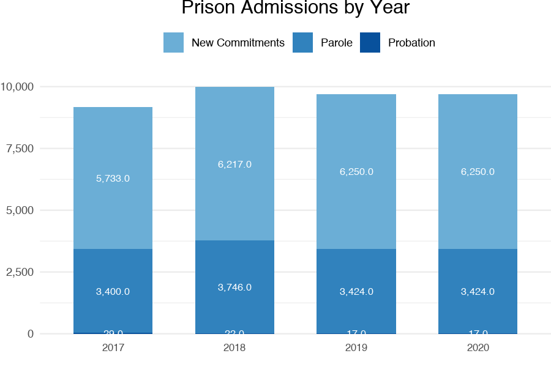
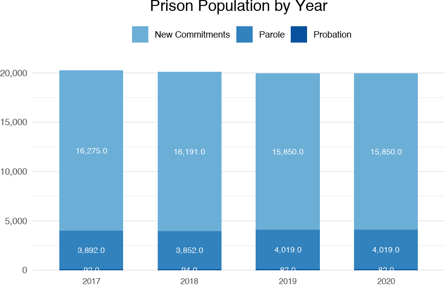
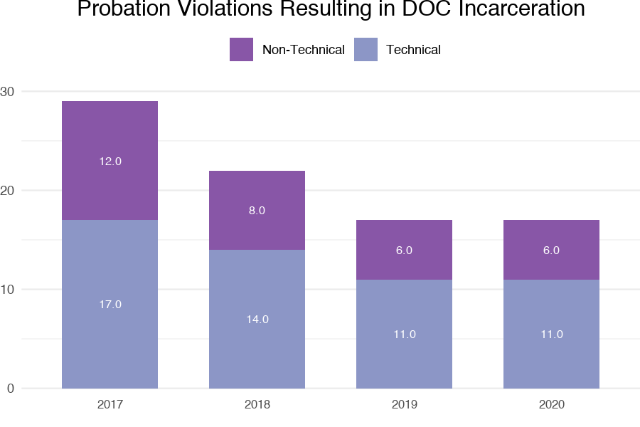
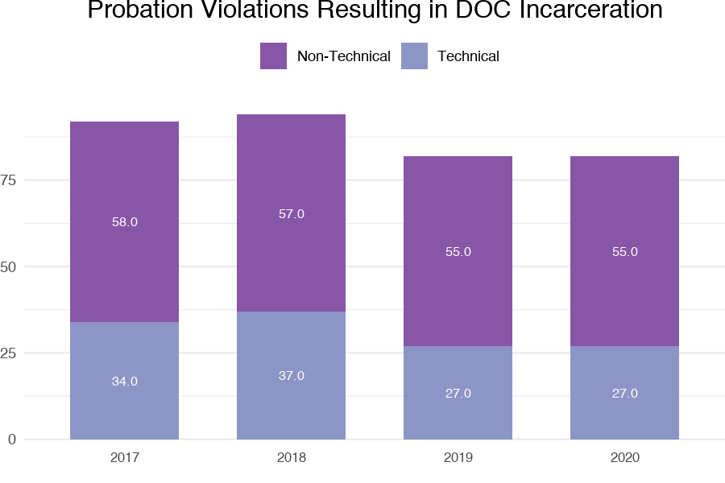
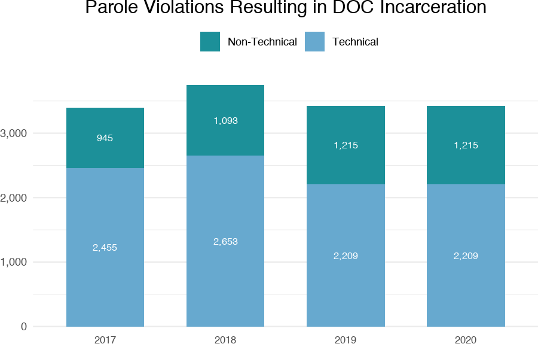
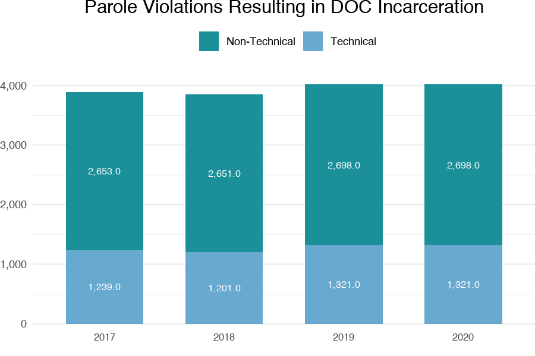
```

Persons in state funded custody only include revocations, not violations. People incarcerated for probation violations are only included in population data if they served probation immediately following a release from Colorado Department of Corrections (i.e., post-prison probation).

\newpage
# Connecticut

```{r echo=FALSE, message=FALSE, warning=FALSE, paged.print=FALSE}
kable(Connecticut, format = 'markdown', padding=1.5L)
kable(Connecticut_Expenditures, format = 'markdown', padding=1.5L)
```
  

```{r echo=FALSE, message=FALSE, warning=FALSE, out.width="50%", paged.print=FALSE}
knitr::include_graphics("plots/adm_by_year_Connecticut.png")
knitr::include_graphics("plots/pop_by_year_Connecticut.png")
knitr::include_graphics("plots/adm_prob_Connecticut.png")
knitr::include_graphics("plots/pop_prob_Connecticut.png")
knitr::include_graphics("plots/adm_parole_Connecticut.png")
knitr::include_graphics("plots/pop_parole_Connecticut.png")
```

Admissions include people incarcerated pretrial, as Connecticut is a unified state where the state has jurisdiction over people incarcerated in both jail and prison. The Connecticut Department of Correction probation violation counts include only people who receive a new sentence of Probation Violation. Parole violation admissions do not include all types of parole (e.g., Returns Without Prejudice, Parcom are excluded). Technical parole violation admissions do not include people who absconded. Technical parole violations may include individuals ultimately receiving a new felony conviction. 

\newpage
# Delaware

```{r echo=FALSE, message=FALSE, warning=FALSE, paged.print=FALSE}
kable(Delaware, format = 'markdown', padding=1.5L)
kable(Delaware_Expenditures, format = 'markdown', padding=1.5L)
```
  

```{r echo=FALSE, message=FALSE, warning=FALSE, out.width="50%", paged.print=FALSE}
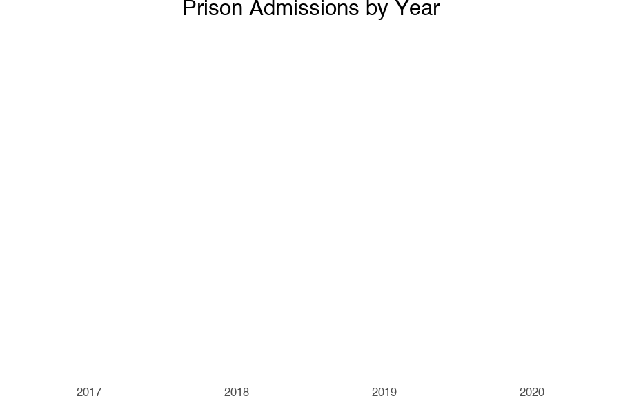
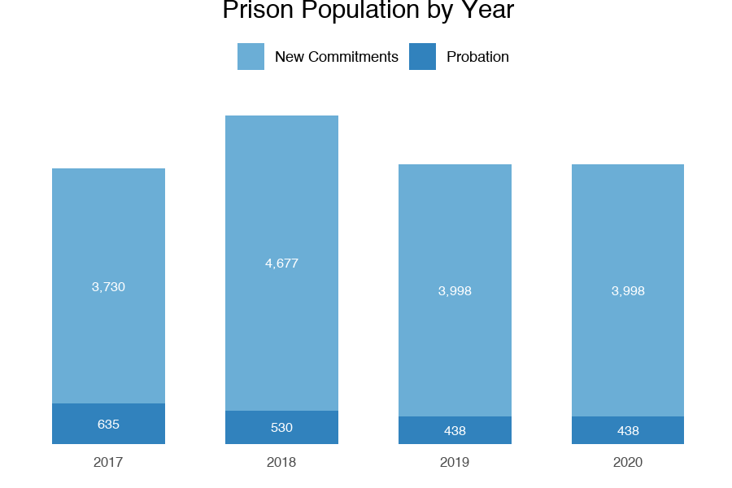
knitr::include_graphics("plots/adm_prob_Delaware.png")
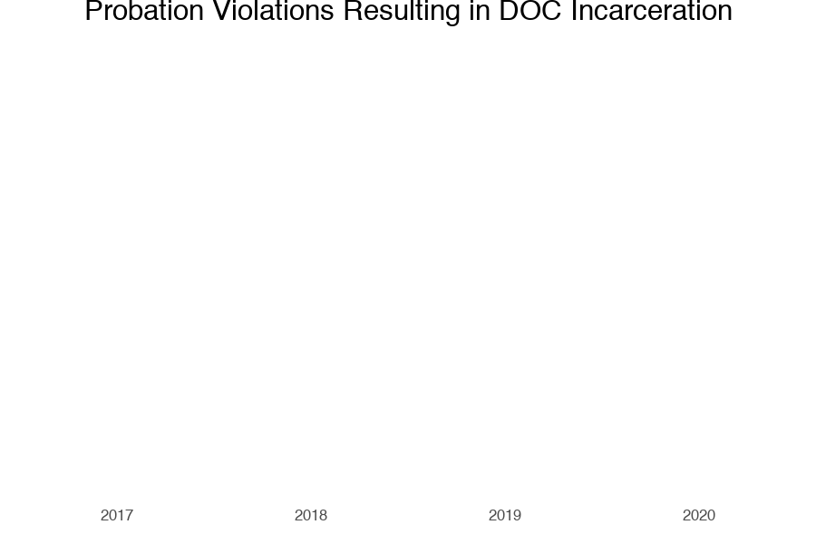


```

Delaware has a unified system, meaning the state has jurisdiction over people incarcerated in both jail and prison. Delaware Department of Correction did not provide violation information for admissions. In Delaware, people incarcerated are admitted using the same codes whether they are detained or sentenced on a technical violation or a violation for a new crime. The state discontinued use of parole on cases after 1991, but a small number of people are still under supervision of the Parole Board. For the purposes of this report, parole populations were not included. 

\newpage
# Illinois

```{r echo=FALSE, message=FALSE, warning=FALSE, paged.print=FALSE}
kable(Illinois, format = 'markdown', padding=1.5L)
kable(Illinois_Expenditures, format = 'markdown', padding=1.5L)
```
  

```{r echo=FALSE, message=FALSE, warning=FALSE, out.width="50%", paged.print=FALSE}
knitr::include_graphics("plots/adm_by_year_Illinois.png")
knitr::include_graphics("plots/pop_by_year_Illinois.png")
knitr::include_graphics("plots/adm_prob_Illinois.png")
knitr::include_graphics("plots/pop_prob_Illinois.png")
knitr::include_graphics("plots/adm_parole_Illinois.png")
knitr::include_graphics("plots/pop_parole_Illinois.png")
```

Probation terms are not identified in prison data, as probation is run by the Illinois Administrative Office of the Courts. In addition to other parole sanction options reported, some individuals are eligible for pre-release electronic detention or partial release work release programs. In the case of some people with a sex offense, parole admissions can include those who never exited due to violation of parole rule requiring an approvable host site. Technical parole violations may include individuals ultimately receiving a new felony conviction.

\newpage
# Indiana

```{r echo=FALSE, message=FALSE, warning=FALSE, paged.print=FALSE}
kable(Indiana, format = 'markdown', padding=1.5L)
kable(Indiana_Expenditures, format = 'markdown', padding=1.5L)
```
  

```{r echo=FALSE, message=FALSE, warning=FALSE, out.width="50%", paged.print=FALSE}
knitr::include_graphics("plots/adm_by_year_Indiana.png")
knitr::include_graphics("plots/pop_by_year_Indiana.png")
knitr::include_graphics("plots/adm_prob_Indiana.png")
knitr::include_graphics("plots/pop_prob_Indiana.png")
knitr::include_graphics("plots/adm_parole_Indiana.png")
knitr::include_graphics("plots/pop_parole_Indiana.png")
```

\newpage
# Louisiana

```{r echo=FALSE, message=FALSE, warning=FALSE, paged.print=FALSE}
kable(Louisiana, format = 'markdown', padding=1.5L)
kable(Louisiana_Expenditures, format = 'markdown', padding=1.5L)
```
  

```{r echo=FALSE, message=FALSE, warning=FALSE, out.width="50%", paged.print=FALSE}
knitr::include_graphics("plots/adm_by_year_Louisiana.png")
knitr::include_graphics("plots/pop_by_year_Louisiana.png")
knitr::include_graphics("plots/adm_prob_Louisiana.png")
knitr::include_graphics("plots/pop_prob_Louisiana.png")
knitr::include_graphics("plots/adm_parole_Louisiana.png")
knitr::include_graphics("plots/pop_parole_Louisiana.png")
```

In the snapshot data provided, total violations for new offences and technical violations includes those who have a pending felony charge who waived their rights to a revocation hearing.

\newpage
# Maine

```{r echo=FALSE, message=FALSE, warning=FALSE, paged.print=FALSE}
kable(Maine, format = 'markdown', padding=1.5L)
kable(Maine_Expenditures, format = 'markdown', padding=1.5L)
```
  

```{r echo=FALSE, message=FALSE, warning=FALSE, out.width="50%", paged.print=FALSE}
knitr::include_graphics("plots/adm_by_year_Maine.png")
knitr::include_graphics("plots/pop_by_year_Maine.png")
knitr::include_graphics("plots/adm_prob_Maine.png")
knitr::include_graphics("plots/pop_prob_Maine.png")
knitr::include_graphics("plots/adm_parole_Maine.png")
knitr::include_graphics("plots/pop_parole_Maine.png")
```

The state abolished parole in 1976 but maintains a very small number of people under parole supervision. For the purposes of this report, parole populations were not included. Technical probation violations may include individuals ultimately receiving a new felony conviction.

\newpage
# Maryland

```{r echo=FALSE, message=FALSE, warning=FALSE, paged.print=FALSE}
kable(Maryland, format = 'markdown', padding=1.5L)
kable(Maryland_Expenditures, format = 'markdown', padding=1.5L)
```
  

```{r echo=FALSE, message=FALSE, warning=FALSE, out.width="50%", paged.print=FALSE}
knitr::include_graphics("plots/adm_by_year_Maryland.png")
knitr::include_graphics("plots/pop_by_year_Maryland.png")
knitr::include_graphics("plots/adm_prob_Maryland.png")
knitr::include_graphics("plots/pop_prob_Maryland.png")
knitr::include_graphics("plots/adm_parole_Maryland.png")
knitr::include_graphics("plots/pop_parole_Maryland.png")
```

For the current iteration of the survey, Maryland Department of Public Safety & Correctional Services (DPSCS) provided additional detail on violations not reported in the previous survey. DPSCS provided additional information on violations going back to July 1, 2014.

\newpage
# Nebraska

```{r echo=FALSE, message=FALSE, warning=FALSE, paged.print=FALSE}
kable(Nebraska, format = 'markdown', padding=1.5L)
kable(Nebraska_Expenditures, format = 'markdown', padding=1.5L)
```
  

```{r echo=FALSE, message=FALSE, warning=FALSE, out.width="50%", paged.print=FALSE}
knitr::include_graphics("plots/adm_by_year_Nebraska.png")
knitr::include_graphics("plots/pop_by_year_Nebraska.png")
knitr::include_graphics("plots/adm_prob_Nebraska.png")
knitr::include_graphics("plots/pop_prob_Nebraska.png")
knitr::include_graphics("plots/adm_parole_Nebraska.png")
knitr::include_graphics("plots/pop_parole_Nebraska.png")
```

While the state did not respond to the survey request for this report, information was obtained by the CSG Justice Center through Nebraska Justice Reinvestment in 2020.

\newpage
# North Carolina

```{r echo=FALSE, message=FALSE, warning=FALSE, paged.print=FALSE}
kable(`North Carolina`, format = 'markdown', padding=1.5L)
kable(`North Carolina_Expenditures`, format = 'markdown', padding=1.5L)
```
  

```{r echo=FALSE, message=FALSE, warning=FALSE, out.width="50%", paged.print=FALSE}
knitr::include_graphics("plots/adm_by_year_North Carolina.png")
knitr::include_graphics("plots/pop_by_year_North Carolina.png")
knitr::include_graphics("plots/adm_prob_North Carolina.png")
knitr::include_graphics("plots/pop_prob_North Carolina.png")
knitr::include_graphics("plots/adm_parole_North Carolina.png")
knitr::include_graphics("plots/pop_parole_North Carolina.png")
```

Figures used include only Conditional Release Violator (CRV) admissions, which represent a minimum estimate for technical violation admissions. CRV facility admissions only include people with technical violations, but there are likely additional technical violation admissions that do not go to CRVs. Technical probation and parole violations may include individuals ultimately receiving a new felony conviction.

\newpage
# North Dakota

```{r echo=FALSE, message=FALSE, warning=FALSE, paged.print=FALSE}
kable(`North Dakota`, format = 'markdown', padding=1.5L)
kable(`North Dakota_Expenditures`, format = 'markdown', padding=1.5L)
```


```{r echo=FALSE, message=FALSE, warning=FALSE, out.width="50%", paged.print=FALSE}
knitr::include_graphics("plots/adm_by_year_North Dakota.png")
knitr::include_graphics("plots/pop_by_year_North Dakota.png")
knitr::include_graphics("plots/adm_prob_North Dakota.png")
knitr::include_graphics("plots/pop_prob_North Dakota.png")
knitr::include_graphics("plots/adm_parole_North Dakota.png")
knitr::include_graphics("plots/pop_parole_North Dakota.png")
```

Technical supervision violations resulting in placement in a contract facility are funded by the state but are not included in the counts provided. Many times, new conviction information is received by the Department of Corrections following a person’s admission for a supervision violation, but the admission type is not updated to reflect the new conviction. Technical probation and parole violations may include individuals ultimately receiving a new felony conviction.

\newpage
# Oklahoma

```{r echo=FALSE, message=FALSE, warning=FALSE, paged.print=FALSE}
kable(Oklahoma, format = 'markdown', padding=1.5L)
kable(Oklahoma_Expenditures, format = 'markdown', padding=1.5L)
```
  

```{r echo=FALSE, message=FALSE, warning=FALSE, out.width="50%", paged.print=FALSE}
knitr::include_graphics("plots/adm_by_year_Oklahoma.png")
knitr::include_graphics("plots/pop_by_year_Oklahoma.png")
knitr::include_graphics("plots/adm_prob_Oklahoma.png")
knitr::include_graphics("plots/pop_prob_Oklahoma.png")
knitr::include_graphics("plots/adm_parole_Oklahoma.png")
knitr::include_graphics("plots/pop_parole_Oklahoma.png")
```

Supervision violation admissions and population data does not include private probation and district attorney supervision. People may return to prison and be identified as having returned due to a technical violation because the disposition of their case has not been determined at that time. Population data does not include admission types for cases older than 15 years.

\newpage
# Rhode Island

```{r echo=FALSE, message=FALSE, warning=FALSE, paged.print=FALSE}
kable(`Rhode Island`, format = 'markdown', padding=1.5L)
kable(`Rhode Island_Expenditures`, format = 'markdown', padding=1.5L)
```
  

```{r echo=FALSE, message=FALSE, warning=FALSE, out.width="50%", paged.print=FALSE}
knitr::include_graphics("plots/adm_by_year_Rhode Island.png")
knitr::include_graphics("plots/pop_by_year_Rhode Island.png")
knitr::include_graphics("plots/adm_prob_Rhode Island.png")
knitr::include_graphics("plots/pop_prob_Rhode Island.png")
knitr::include_graphics("plots/adm_parole_Rhode Island.png")
knitr::include_graphics("plots/pop_parole_Rhode Island.png")
```

Rhode Island is a unified state, where the state has jurisdiction over people incarcerated in both jail and prison, but figures exclude all admissions awaiting trial and include only sentenced admissions. This was done to more closely align with state definitions and reports. Rhode Island Department of Corrections provided the number of cases where an outcome was still pending. These cases were excluded in the figures reported.

\newpage
# Texas

```{r echo=FALSE, message=FALSE, warning=FALSE, paged.print=FALSE}
kable(Texas, format = 'markdown', padding=1.5L)
kable(Texas_Expenditures, format = 'markdown', padding=1.5L)
```
  

```{r echo=FALSE, message=FALSE, warning=FALSE, out.width="50%", paged.print=FALSE}
knitr::include_graphics("plots/adm_by_year_Texas.png")
knitr::include_graphics("plots/pop_by_year_Texas.png")
knitr::include_graphics("plots/adm_prob_Texas.png")
knitr::include_graphics("plots/pop_prob_Texas.png")
knitr::include_graphics("plots/adm_parole_Texas.png")
knitr::include_graphics("plots/pop_parole_Texas.png")
```

All admissions data include prison, state jail, and Substance Abuse Facility Program (SAFP) admissions. Other alternative and substance addiction and mental health treatment facility admissions are not included. Only people on felony probation can legally be revoked to prison. Parole violation admissions include Mandatory Supervision and Discretionary Mandatory Supervision violation admissions, as well as parole violation admissions to SAFP. This iteration of the survey reports only those probation revocations admitted to TDCJ based on a match of Texas Department of Criminal Justice (TDCJ) and Community Justice Assistance Division (CJAD) data. The prior iteration of the survey included probation revocations not actually admitted. 

\newpage
# Vermont

```{r echo=FALSE, message=FALSE, warning=FALSE, paged.print=FALSE}
kable(Vermont, format = 'markdown', padding=1.5L)
kable(Vermont_Expenditures, format = 'markdown', padding=1.5L)
```
  

```{r echo=FALSE, message=FALSE, warning=FALSE, out.width="50%", paged.print=FALSE}
knitr::include_graphics("plots/adm_by_year_Vermont.png")
knitr::include_graphics("plots/pop_by_year_Vermont.png")
knitr::include_graphics("plots/adm_prob_Vermont.png")
knitr::include_graphics("plots/pop_prob_Vermont.png")
knitr::include_graphics("plots/adm_parole_Vermont.png")
knitr::include_graphics("plots/pop_parole_Vermont.png")
```

Parole admissions and snapshot total includes people returning from both parole and furlough. Snapshot total prison population data include those housed out-of-state (due to potential movement between in-state and out-of-state Vermont inmates), but does not include those detained pre-trial or held for another jurisdiction.

\newpage
# West Virginia

```{r echo=FALSE, message=FALSE, warning=FALSE, paged.print=FALSE}
kable(`West Virginia`, format = 'markdown', padding=1.5L)
kable(`West Virginia_Expenditures`, format = 'markdown', padding=1.5L)
```
  

```{r echo=FALSE, message=FALSE, warning=FALSE, out.width="50%", paged.print=FALSE}
knitr::include_graphics("plots/adm_by_year_West Virginia.png")
knitr::include_graphics("plots/pop_by_year_West Virginia.png")
knitr::include_graphics("plots/adm_prob_West Virginia.png")
knitr::include_graphics("plots/pop_prob_West Virginia.png")
knitr::include_graphics("plots/adm_parole_West Virginia.png")
knitr::include_graphics("plots/pop_parole_West Virginia.png")
```

Additional types of supervision were not included in this analysis, such as Community Corrections, Home Confinement, and Sex Offender Supervision Release revocations. Technical probation violations may include individuals ultimately receiving a new felony conviction.

\newpage
# Wyoming

```{r echo=FALSE, message=FALSE, warning=FALSE, paged.print=FALSE}
kable(Wyoming, format = 'markdown', padding=1.5L)
kable(Wyoming_Expenditures, format = 'markdown', padding=1.5L)
```
  

```{r echo=FALSE, message=FALSE, warning=FALSE, out.width="50%", paged.print=FALSE}
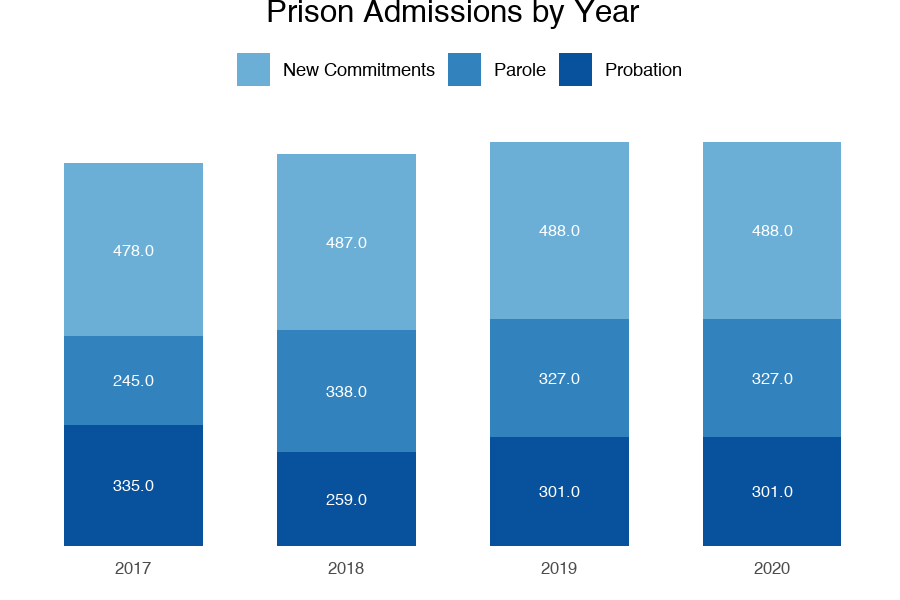
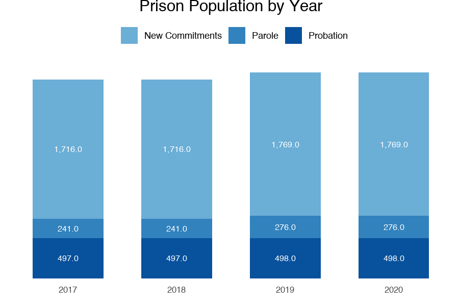
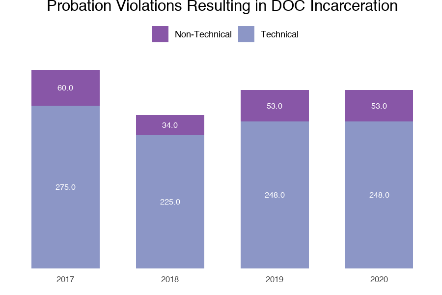
knitr::include_graphics("plots/pop_prob_Wyoming.png")
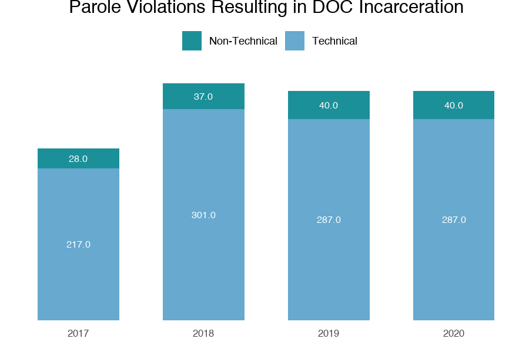
knitr::include_graphics("plots/pop_parole_Wyoming.png")
```

Parole violation admissions include returns from work release, but in the population data, work release returns were not defined and there for not included.

