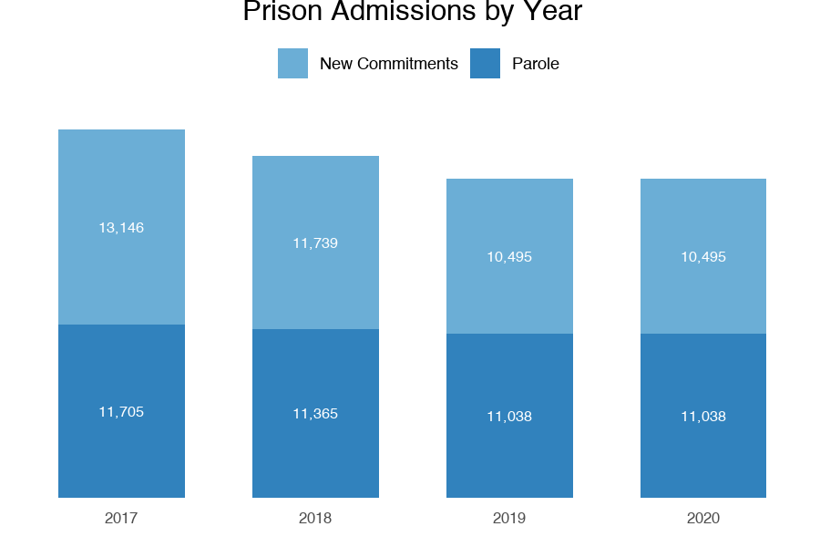
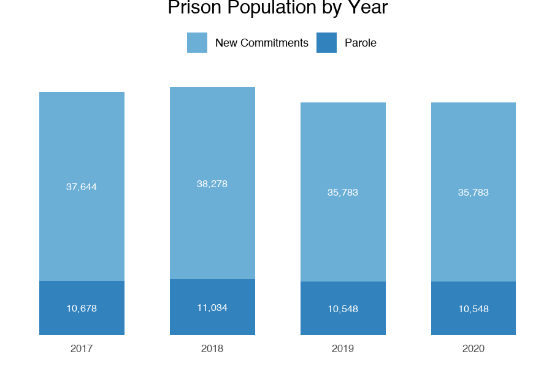

```{r setup, include=FALSE}
knitr::opts_chunk$set(echo = TRUE)
```

```{r message=FALSE, warning=FALSE, include=FALSE, paged.print=FALSE}
# load clean data from automated_clean.R
#source("automated_plots.R")
```

# Background


# Alaska

```{r echo=FALSE, message=FALSE, warning=FALSE, out.width="50%", paged.print=FALSE}
knitr::include_graphics("plots/adm_by_year_Alaska.png")
knitr::include_graphics("plots/pop_by_year_Alaska.png")
```


# Alabama

```{r echo=FALSE, message=FALSE, warning=FALSE, out.width="50%", paged.print=FALSE}
knitr::include_graphics("plots/adm_by_year_Alabama.png")
knitr::include_graphics("plots/pop_by_year_Alabama.png")
```

# Delaware

```{r echo=FALSE, message=FALSE, warning=FALSE, out.width="50%", paged.print=FALSE}
knitr::include_graphics("plots/adm_by_year_Delaware.png")
knitr::include_graphics("plots/pop_by_year_Delaware.png")
```

# New York

```{r echo=FALSE, message=FALSE, warning=FALSE, out.width="50%", paged.print=FALSE}


```


